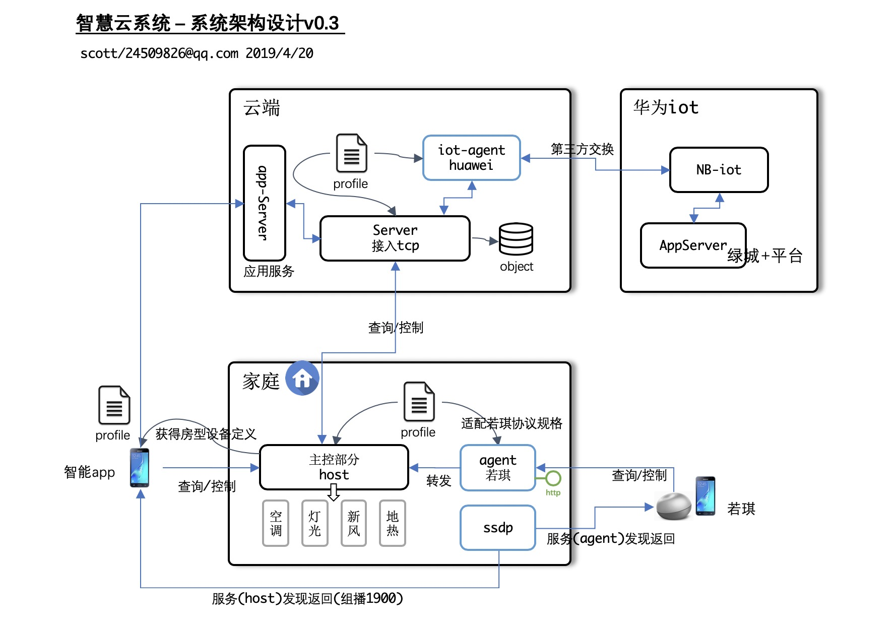

## 1. 服务列表

#### 1. AppServer  
> 提供app访问控制设备的云端服务器。端口：9002.
> 主要接口: 查询设备状态、发送设备控制命令、查询设备profile..

运行:
```bash
python AppServer/src/smartbox-appserver.py
```

#### 2. RealPushServer
> app 与pushserver建立tcp连接，设备状态在此通道上被推送到app. 端口: 9100 

> 订阅/取消订阅。

运行:
```bash
python RealPushServer/src/smartbox-real-push-server.py
```


#### 3. LoginServer
> 智能主机smartbox登录系统，并请求`loginserver`获取接入服务器`boxserver`的主机接入信息。 端口: 9021 


运行:
```bash
python LoginServer/src/start-loginserver.py
```


#### 4. BoxServer
> 智能主机`smartbox`的设备接入服务器。 端口: 9088 


运行:
```bash
python BoxServer/src/start-boxserver.py
```


## 2. 安装、运行配置

### Linux 系统

##### 系统软件安装
```bash
su - root 
yum install mongodb redis-server 
yum install tmux telnet htop 

```
##### 主机名设置
```bash
vi /etc/hosts 
  127.0.0.1 mongodb 
  127.0.0.1 redis 
```

##### 用户账户
```
useradd dba 
useradd smarthome 
```

##### 安装 Anaconda

##### 运行 mongodb / redis
```
端口: 27017 / 6379

su - dba 
mkdir -p /home/dba/data 
mongod --dbpath=/home/dba/data
redis-server 
```

##### Mantis环境
```bash
export PYTHONPATH=/home/smarthome/pythonpath
```

## 3. 服务配置

测试设备
 
> 授权码: `A001`  设备编号: `[FBXDDD0001,]`
 
 初始化授权码
 
 ```
 python RealPushServer/tests/test-init-authcode.py
 ```
 
 初始化设备记录
 ```
 vi init-data.yaml
 python BoxServer/tests/test-init-database.py
 ```

## 4. 服务运行

账户`smarthome`运行所有服务。 

 - 启动 redis/mongodb 服务
 - 运行各服务启动脚本
 
## 5. 主机设备
设备运行配置文件  `settings.txt`。 修改如下参数：
```text 
login_server_url=http://wallizard.com:9021/server/api/login  登录服务器地址
mcu_channel_host = 192.168.0.51   主机上单片机控制调度程序的服务端口
id=FBXDDD0001  设备硬件编码
```
 
## 6. nginx 代理配置

```bash
server {
         listen       19002 default_server;
         server_name  _;
         root         /usr/share/nginx/html;
         include /etc/nginx/default.d/*.conf;
         location / {
              proxy_pass http://localhost:19002;
          }
     }
server {
         listen       19021 default_server;
         server_name  _;
         root         /usr/share/nginx/html;
         include /etc/nginx/default.d/*.conf;
         location / {
              proxy_pass http://localhost:19021;
          }
     }

server {
         listen       19900 default_server;
         server_name  _;
         root         /usr/share/nginx/html;
         include /etc/nginx/default.d/*.conf;
         location / {
              proxy_pass http://localhost:19900;
          }
     }
}
stream {
    server {
            listen 19088;
            proxy_pass 127.0.0.1:19088;
    }
    server {
            listen 19100;
            proxy_pass 127.0.0.1:19100;
    }
}    
```
